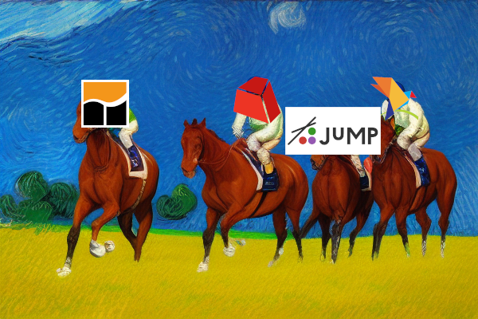

## TL;DR

🫵 You shouldn't run a single model and call it a benchmark

🙊 `JuMP` is slower than `pyomo`? Really?

😤 At least the `gurobipy` code is not something I would write

<!-- more -->

## Background

On the 4th of July, GAMS [posted](https://www.gams.com/blog/2023/07/performance-in-optimization-models-a-comparative-analysis-of-gams-pyomo-gurobipy-and-jump/) a "comparative analysis" (=benchmark) of GAMS versus `JuMP`, `pyomo` and `gurobipy`. There is a lot to unpack in that article, so let's get started:

## The good

GAMS is actually pretty neat for model generation. And they are right when they say:

> GAMS has proven to be a powerful optimization tool due to its use of relational algebra and efficient handling of complex variable definitions. Its mathematical notation also allows for intuitive and readable model implementations. 

I have tried to "beat" GAMS two or three times in model generation speed using `gurobipy`, and it is pretty tough. The best I've gotten was around 10% slower than GAMS.

This makes sense, because GAMS has focused on this problem for decades, it is their main selling point.

Also, I appreciate that they made [the code and data public](https://github.com/justine18/performance_experiment), and it actually runs.

## The questionable

However, the article makes a few statements that are questionable:

1. > With general-purpose languages like Python and Julia, a straightforward implementation closely aligned with the mathematical formulation is often self-evident and easier to implement, read, and maintain, but suffers from inadequate performance. 

This is really dicey. I am quite surprised that so far nobody from the Julia community has come out to challenge this statement. I will comment on the Python bit, specifically `gurobipy`: you can write very, very efficient `gurobipy` code that is highly readable. Consider for example [this](https://www.gurobi.com/documentation/9.0/examples/matrix2_py.html):

```
m.addConstr(x[i, :].sum() <= 1, name=f"row_{i}")
```

This is using efficient vector operations under the hood (think `numpy` but for variables) and is highly efficient. Yet, I would argue it is also incredibly readable.

On the other side, this is GAMS code from the benchmark:

```
ei(i).. sum((IJK(i,j,k),JKL(j,k,l),KLM(k,l,m)), x(i,j,k,l,m)) =g= 0;
```

This does not look pretty to me (let alone easy to debug).

2. The "fast" `gurobipy`

> We see the same principle that applies to JuMP when it comes to modeling frameworks like GurobiPy and Pyomo with the underlying language Python. 

The [code](https://github.com/justine18/performance_experiment/blob/master/IJKLM/run_gurobipy.py) they show for `gurobipy` is questionable, to say the least. Consider this snippet:

```
 x = model.addVars(x_list, name="x")

constraint_dict_i = {i: [] for i in I}
constraint_dict_i.update(
    {
        i: list(j)
        for i, j in itertools.groupby(sorted(x_list), operator.itemgetter(0))
    }
)

model.setObjective(1, gpy.GRB.MINIMIZE)

model.addConstrs(
    (gpy.quicksum(x[ijklm] for ijklm in constraint_dict_i[i]) >= 0 for i in I),
    "ei",
)

model.update()
```

There is so much to unpack here, but in a nutshell: no respectable Python programmer would write code like this.

This does not change the fundamental statement of the article, I just don't think it is nice that the code itself is not reflecting what the language or the API can do.

3. `JuMP` is slower than `pyomo`?

Eventually I will make a post about modeling frameworks, but `pyomo` is definitely not one that is known for its model building speed. On the flip side, `JuMP` was a core package for Julia from the start, and is very much written with speed in mind.

I don't know enough Julia to judge the code quality, but `JuMP` being factor 2-3 slower(!!) than `pyomo` makes no sense to me (plot from the article):


> Side note: on several occasions, the article calls `gurobipy` a modeling framework. That's wrong (in my opinion), since the defining characteristic of a modeling framework is that you can use several solvers with it. `gurobipy` is simply the Python API for Gurobi, so it only supports Gurobi as a solver.

## The problematic

The main problem with the article is that it uses a single example to make a general point. They even say this outright:

> Other recent research also focuses on efficiency of model generation. The paper Linopy: Linear optimization with n-dimensional labeled variables compares some open source modeling frameworks but unfortunately chose a dense model (the knapsack problem) as a benchmark problem. In our experience dense models are extremely rare in practice and don’t really represent a challenge with respect to model generation.

"Unfortunately"? I agree that many MIPs we see in practice are typically sparse, but also most MIPs I have seen in practice don't have 5 indices that are combined in a random fashion.

That doesn't mean they shouldn't have done the study, or written the article. But as you may remember from my [benchmarking article](https://oberdieck.dk/p/pick-a-solver/): "The first rule of benchmarking is: **your test set defines your test results**". This is why benchmarking is so hard: because finding a representative and robust test data set is really time consuming.

Fortunately, they are not saying anything I would call "completely wrong" in the article. But that doesn't mean they did a good job when creating their data from which they draw their conclusions.
