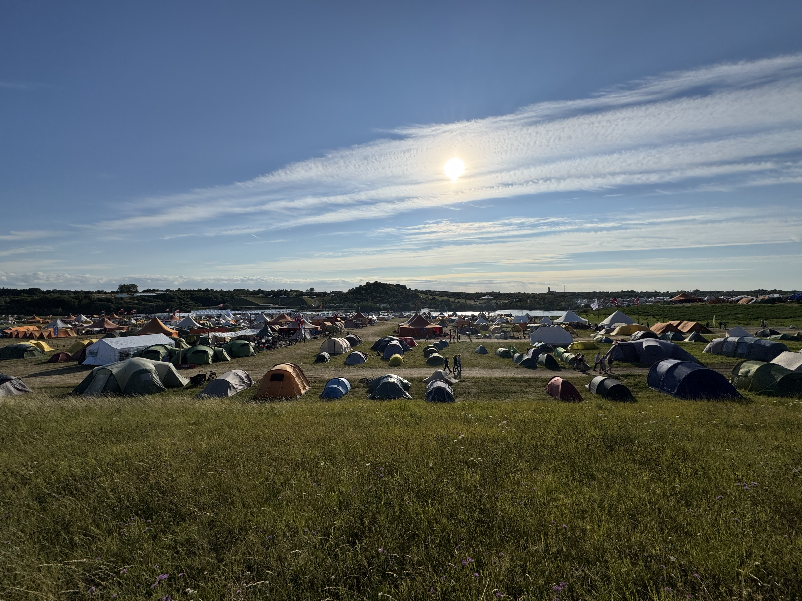
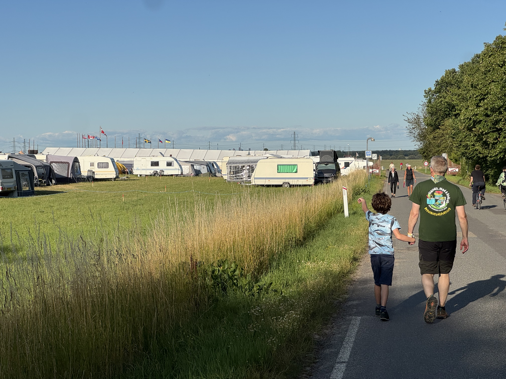

## TL;DR

⛺ The Danish Jamboree just finished, with over 23000 scouts attending from over 20 countries, staying for up to 8 days on fields just outside of Roskilde

🏋️‍♀️ To say that planning is a challenge here is an understatement: tend allocations, water and sewage, food, neighboring villages and much more needs to be dealt with

🧗 Our focus today: planning activities, i.e. what the scouts are going to do while at the camp. Collected in groups of 50-150, with age limits, priorities. In short, a good old allocation problem

🧑‍💻 The details are in the post, but in short [Torben](https://www.linkedin.com/in/torben-skov-6b00012/) actually did all that and it worked! A huge shoutout to him for all the effort to improve the experience of the scouts, all as a volunteer. Be like Torben!

<!-- more -->

## Meet the person behind the problem

Last March I gave a tutorial at the IT University Denmark about testing optimization code - incidentally it was that tutorial that was the basis of [my last blog post](./testing-optimization.md). One of the participants was [Torben](https://www.linkedin.com/in/torben-skov-6b00012/), a consultant from SAS (the software company, not the airline), who was completely new to Python, let alone unit testing. But that did not stop him. A few days after the tutorial he reached out on LinkedIn and asked to meet.

One of his passions is being a scout, but what the hell is a scout? Here is a short intro (yeah, I know, a bit cheesy):

<iframe width="560" height="315" src="https://www.youtube.com/embed/alG9k5qC5gU?si=CcljI6gPv75SNqxi" title="YouTube video player" frameborder="0" allow="accelerometer; autoplay; clipboard-write; encrypted-media; gyroscope; picture-in-picture; web-share" referrerpolicy="strict-origin-when-cross-origin" allowfullscreen></iframe>

So Torben had been a scout for close to 50 years at that point, and was part of the team that was organizing the Danish [Jamboree](https://en.wikipedia.org/wiki/Jamboree) in 2026 ([event website](https://spejderneslejr.dk/en/)). An event that takes place every 4 years, hosts over 20'000 people for over a week from over 20 countries.

At this point your optimization heart should be super excited because we all know that when complexity meets scale, optimization can likely help.

## So what was the problem?

The problem that Torben was looking at specifically was the allocation of scout groups to activities. The scouts are divided into groups of 50-150 scouts, each of which has the following characteristics:

- Size, i.e. number of scouts
- Age
- List of ordered priorities
- Timeslots where the group can and cannot do activities

Then we have the activities, which has:

- Size limit
- Age limit
- Duration
- Time window
- Location (optional)

We then have pretty straightforward constraints:

- Age limit per activity
- Size limit per activity
- A group can attend one activity at a time
- Group timeslots have to be respected
- Activity time windows have to be respected
- Travel time between locations of different activities needs to possible, if applicable.

Finally, the objectives are as follows:

- Maximize the number of fulfilled priorities per group. A higher priority has more value, but not defined what it should be
- Distribute activities across the week
- Aim to keep the number of priorities fulfilled similar between groups, i.e. "fairness"

All in all, there were 2344 groups, 124 activities with a total of 1431 sessions. The good thing though is that this only had to be solved once, so model build and solve time constraints did not really apply.

## Why is this worth talking about?

If you've done OR for a while, this looks like a pretty vanilla problem. So why do I spend the time on a nice Saturday afternoon writing about it? Well, because of the journey it took to get there. As I wrote before, Torben did not know Python before. Yet, he attacked this problem, and over the course of countless hours over many months, he actually made it work.

All the code and the data is open-source [here](https://github.com/RichardOberdieck/opti_scout), and if you browse throug the commit history, you can track his thought process as he learns how to deal with the challenge.

Another reason it is worth talking about is a sentiment that my former boss [Kostja](https://www.linkedin.com/in/kostjasiefen/) stated quite well recently on [LinkedIn](https://www.linkedin.com/feed/update/urn:li:activity:7462050775037321217/):

> Make the world a better place, one optimal solution at a time

He said it in the context of Gurobi, but I feel like it applies even more to this type of volunteer optimization things. Nobody would ever know about the work Torben put in, and the thousands of people who benefitted likely never gave it a thought. Yet he has made the world a little bit better of a place, by using smarter decision making.

## So what's next?

This Jamboree happens every 4 year, so let's see what 2030 will have in store for us. Torben and I are in touch, and I think by the time 2029 rolls around, we may even find a few other problems in the planning process (like where to put the tents) where we can hopefully improve the world ever so slightly.

Until then, do some volunteer work, help make the world a better place, one optimal solution at a time.

