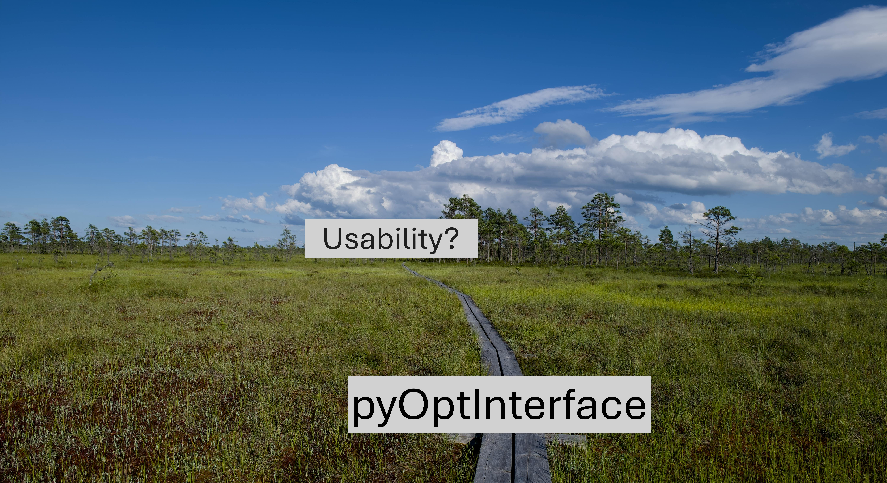
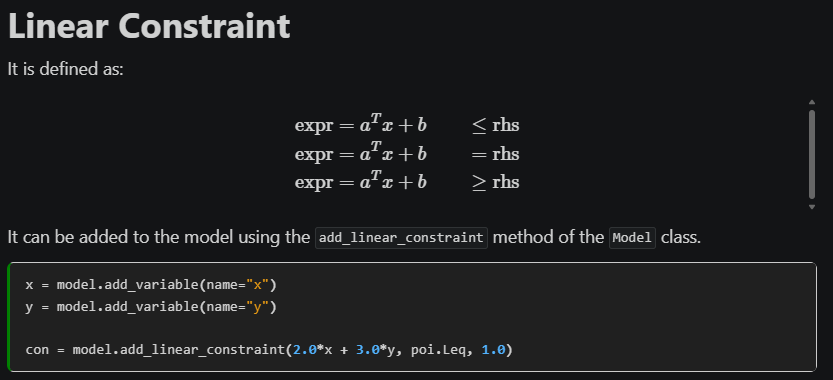

## TL;DR

🧮 `pyOptInterface` is a new Python modeling framework first released in April 2024 and is currently in version 0.4.1.

👏 It is well-written, and really quite fast. It has decent documentation, and also supports conic and nonlinear programming.

💡💡💡💡💡💡💡💡💡💡💡💡💡

🙌 The internet is AWESOME! Based on my testing, I thought the constraint handling in `pyOptInterface` was bad. But then, I posted my article and got awesome feedback from [Robert Schwarz](https://www.linkedin.com/in/robertcschwarz/) about how to do this well. So now, I am a big fan 😊 

🍂 I don't want to ignore my mishap, but I also don't think it adds value. So I am changing the article from ground up but with references to the original when needed. If you are interested, just go to [this commit](https://github.com/RichardOberdieck/personal-homepage/commit/d4492802678edddc7453decd2bdddcd5ba1de88e) in the repo.

<!-- more -->

## What is `pyOptInterface`?

It ([code](https://github.com/metab0t/PyOptInterface/tree/master), [docs](https://metab0t.github.io/PyOptInterface/index.html)) is a modeling framework in Python, i.e. a way that allows you to write optimization models and then interface with different solvers. As of May 2025, it supports Gurobi, COPT, HiGHS, Mosek and Ipopt. So far, so straightforward. But is it any good? And how does it compare to [`pyomo`](https://github.com/Pyomo/) or [`python-mip`](https://github.com/coin-or/python-mip)? Let's find out!

!!! note
    Almost all modeling frameworks are written in Python. The only non-Python one I am aware of is the C# package [`Optano.Modeling`](https://www.nuget.org/packages/OPTANO.Modeling), not counting [`JuMP`](https://jump.dev/), which is baked directly into Julia.

## Why and how to choose a modeling framework?

- It makes **switching solvers simple**. This is relevant e.g. when you:
    - have a limited number of licenses for a commercial solver
    - are evaluating different solvers
- It may be a nicer interface than the underlying solver you want to use
- It makes your code more accessible for use, e.g. if you want to give your end user the ability to toggle between solvers

So given these use cases, my criteria for a good modeling framework is:
 
1. It has to be **free and open-source**. This is important because I need to check how it works, fork it if necessary and not have an additional expense if I am already using to avoid buying more licenses.
2. It needs to be **easy to use**. If the main "product" is the interface, it should be a nice interface.
3. It should be **fast**. This is less important than ease of use for me, because I could just use the interface of the solver directly, if it is easier to use. However, if two frameworks are roughly of the same ease-of-use, speed becomes a critical factor.
4. It should be **maintained**. I don't like using libraries which have not had an update in years.

## So, how does `pyOptInterface` do?

> I am going at this from a LP and MIP perspective, which is the vast majority of optimization use cases.

| Criteria    | `pyOptInterface`    | `pyomo`             | `python-mip`
| ----------- | --------------------| --------------------| --------------------
| FOSS (license)       | ✅ ([MPL 2.0](https://github.com/metab0t/PyOptInterface/tree/master?tab=License-1-ov-file))                | ✅ ([BSD-3](https://github.com/Pyomo/pyomo?tab=License-1-ov-file))                 | ✅ ([EPL 2.0](https://github.com/coin-or/python-mip?tab=EPL-2.0-1-ov-file))
| Ease-of-use | ✅                 | ❌                  | ✅
| Fast        | ✅                | ❌                  | ✅
| Maintained (last release) | ✅ ([19/3/2025](https://github.com/metab0t/PyOptInterface/releases/tag/v0.4.1))                | ✅ ([16/4/2025](https://github.com/Pyomo/pyomo/releases/tag/6.9.2))                 | ❌ ([4/1/2023](https://github.com/coin-or/python-mip/releases/tag/1.15.0))

!!! note
    I have also heard of [`feloopy`](https://github.com/feloopy/feloopy), but have not had a chance to take it for a spin so I can't give my opinion yet.

Needless to say that all of this is my own opinion, but let us dive into why I have that opinion of `pyOptInterface`.

## The obvious

It's free and open-source, which is critical. However, there is a caveat:

!!! warning
    The [MPL 2.0](https://www.mozilla.org/en-US/MPL/2.0/) license is a **copyleft** license. Specifically, this means that any works derived from this license also **have to be open-sourced under the same license**:

    > "All distribution of Covered Software in Source Code Form, including any Modifications that You create or to which You contribute, must be under the terms of this License." (Section 3.1)

What does that mean? I let [Oscar Dowson](https://www.linkedin.com/in/oscar-dowson-544704272/) fill you in:

!!! quote
    The copyleft applies only to the source code distributed under MPL. If you made a Python package which depends on an MPL dependency, that package does not need to be released under MPL. You really need to worry only if you modify the source code of PyOptInterface and redistribute it. FWIW: JuMP uses MPL as well, and we find it is a good middle ground. You can do pretty much anything, including sell it in a commercial product, but you must release source modifications of the existing files back to the community.

I am strong proponent of FOSS since [the world runs on it](https://truelist.co/blog/linux-statistics/). So thumbs up from me.

Also, it seems to be maintained, although still not on v1. But I am sure that will come.

Finally, it is fast. Since it hooks into the C++ interfaces of the various solvers, it saves itself the model construction hell of `pyomo` in Python, and hence is a breeze to work with in my experience.

## The not so obvious

!!! note
    Previously, this section was critical of the way constraints needed to be written in `pyOptInterface`. However, thanks to [Robert Schwarz](https://www.linkedin.com/in/robertcschwarz/) I stand corrected. However, that then leads me to say something about the documentation 😊

`pyOptInterface` is actually nice to use. At first, I thought it would not be, since this is what is given on the `README` of the package as example usage:

```python
import pyoptinterface as poi
from pyoptinterface import highs

model = highs.Model()

x = model.add_variable(lb=0, ub=1, domain=poi.VariableDomain.Continuous, name="x")
y = model.add_variable(lb=0, ub=1, domain=poi.VariableDomain.Integer, name="y")

con = model.add_linear_constraint(x+y, poi.Geq, 1.2, name="con")

obj = 2*x
model.set_objective(obj, poi.ObjectiveSense.Minimize)
```

Also when looking at the [documentation](https://metab0t.github.io/PyOptInterface/constraint.html), it seems that this is the way to go:



However, this is **not** true. Instead, `pyOptInterface` took a page out of the book of `JuMP` and `Gurobi` and implemented it well. You can also write:

```python
import pyoptinterface as poi
from pyoptinterface import highs, VariableDomain

N = 10
model = highs.Model()

x = {c: model.add_variable(domain=VariableDomain.Binary, name=f"x_{c}") for c in range(N)}

model.add_linear_constraint(x[0] + x[1] <= 1.0)
model.add_linear_constraint(x[0] + x[1] <= x[2])
model.add_linear_constraint(x[1] == x[3])
```

And even
```python
model.add_linear_constraint(poi.quicksum(x.values()) == 1)
```

So they did implement [operator overload](https://www.geeksforgeeks.org/operator-overloading-in-python/), and allowed for left-hand side and right-hand side to mix, which is really nice. They also implemented a [`quicksum`](https://metab0t.github.io/PyOptInterface/container.html#quicksum) similar to [`gurobipy`](https://docs.gurobi.com/projects/optimizer/en/current/reference/python/func_global.html#quicksum), which is based on a [`tupledict`](https://metab0t.github.io/PyOptInterface/container.html#create-a-tupledict), another thing that `gurobipy` users will find [familiar](https://docs.gurobi.com/projects/optimizer/en/current/reference/python/tupledict.html).

And it works! This was my biggest problem when using it in my [`opti_test`](https://github.com/RichardOberdieck/opti_test) project, and somehow I missed it. But I am very happy to set the record straight. And although I may have had to know better, I suggest to change the docs to highlight this feature. It really is a game changer for me. This completely changes my opinion. When I didn't know, I wrote this as my conclusion:

!!! quote
    As [I've said before](https://oberdieck.dk/2024/11/12/goodbye-python-mip/), there is a big hole in the optimization landscape for a well-performing, easy to handle modeling framework. However, in its current form `pyOptInterface` is not it. However, they did a lot of things right. So with some ChatGPT, some inspiration from `python-mip` and other places and hopefully some contributors, this should be doable. I'm looking forward to it!

Now, I will probably use it as a daily driver for my optimization projects since it really does look nice. Thank you, [Yue Yang](https://www.linkedin.com/in/yang-yue-5b30681b0/) and [Ke Shi](https://keshi.pro/) for creating such a nice package! I hope it will continue to be developed and improved!
